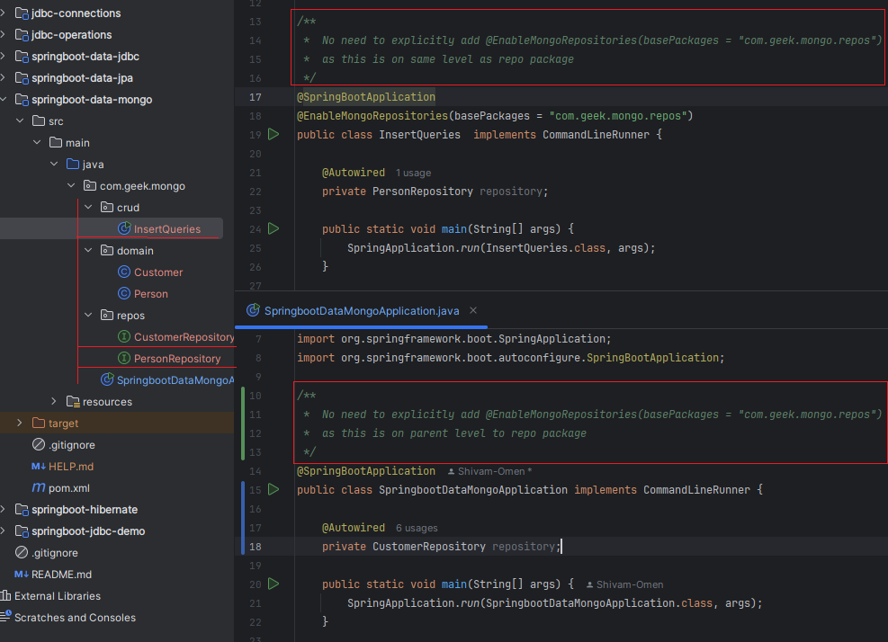

## _JDBC_

1. javax.sql.DataSource
2. java.sql.DriverManager

* **JDBC Consolidated URL:** `jdbc:db_type://host:port/db_Name?user={userName}&password={password}`
  
| DataBase Vendor                |Consolidated URL                              |driver
|--------------------------------|-----------------------------------------   |----------------------
|MySQL                           | `jdbc:mysql://host:port/db_Name`           | `com.mysql.cj.jdbc.Driver`
|Oracle                          | `jdbc:oracle:thin:@://host:port/db_Name`   | `oracle.jdbc.OracleDriver`
|SQL Server                      | `jdbc:sqlserver://host:port/db_Name`       | `com.microsoft.sqlserver.jdbc.SQLServerDriver`

* Important interfaces & Classes for JDBC API:- `Connection`, `Statement`, `PreparedStatement`, `ResultSet`, `CallableStatement`
*******************************************************************************************************************************************************************
## _SpringBootJDBC_

1. JdbcTemplate
2. NamedParameterJdbcTemplate

## _SpringBootHibernate_
| DataBase Vendor                |Dialect
|--------------------------------|----------------------------------------
|MySQL                           | `org.hibernate.dialect.MySQL5Dialect`
|Oracle                          | `org.hibernate.dialect.OracleDialect`

# Mongo Db Pointers

* Docker image pull command: docker pull mongo:8.0.10
    
* Run Command: docker run --name mongo-container -d -p 27017:27017 <image_id>
    
* When the repository package is on the different level to @SpringBootApplication / @EnableAutoConfiguration,
  then we need to explicitly add the following annotation to the main class in order for spring boot to
  read the mongo repositories. 

    

